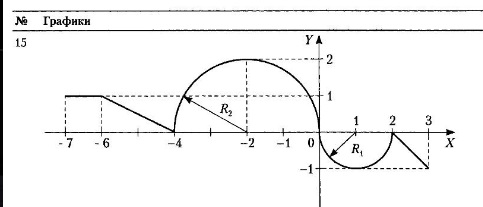

# Лабораторная работа 2.
## Функции.
### Теоретический материал: функции.
Вычисление значения функции
Напишите программу,которая по введенному значению аргумента вычисляет значение функции, заданной в виде графика. Вычисления должны проводиться с помощью функции.

